# JCON
このリポジトリは、モバイルアプリケーション **JCON Controller** を使用してカスタムBLEデバイスを制御するためのファームウェアサンプルコードおよび技術ドキュメントを提供します。

---

## JCON  - JSON Controller アプリ概要

JCON Controller は、DIYハードウェアのためのワイヤレスコントローラーです。スマートフォンからBLE経由でリアルタイムなJSONデータをマイコン（ESP32, Raspberry Pi Picoなど）に送信します。

### 更新情報
| バージョン                     | 配信開始日                                               | 機能，更新情報など                            |
| :----------------------- | :------------------------------------------------ | :------------------------------ |
| **ver1.0.0** | 2025/11/11 | 基本機能(JSONキー名任意設定，ESP32との接続) |
| **ver1.1.0** | 2025/11/27 | ダークモード対応，アクセントカラー追加(黄色，オレンジ) |
| **ver1.2.0** | 2025/12/11 | 外部ゲームパッド対応，マイコンとの送受信対応，メイン画面のJSONモニタの送信/受信切替，Raspberry Pi Pico Wでの動作確認 |
| **ver1.2.1** | 審査中 | 設定画面でゲームパッドのラベルを変更しても反映されない問題を解決 |

**【アプリの特徴】**
* **カスタマイズ性**: 12個のコントロールスロット（ボタン, ジョイスティック, スライダー）を自由に設定可能。
* **データ形式**: 軽量なJSON形式でデータを送信。マイコン側で簡単にパースできます。
* **安定接続**: デバイス名プレフィックス（`JCON-`）とサービスUUIDによる効率的なフィルタリング。

## サンプルファームソースコード

以下のリンクから、各マイコンボードで使用可能なファームウェアのサンプルコードをダウンロードできます。
 
* **サンプルコード(for ESP32)**:https://github.com/jani-onct/JCON-JSON_Controller/tree/main/sample/JCON_ESP32
* **サンプルコード(for Rapberry Pi Pico W)**:https://github.com/jani-onct/JCON-JSON_Controller/tree/main/sample/JCON_PicoW

## アプリの説明 
アプリには4つの基本画面があります。

### **操作画面**
  メインのコントローラー画面です。  
  ボタン、ジョイスティック、スライダーなどを自分の好きなように配置することができます。JSONモニターを有効化すると、送信しているJSONをリアルタイムで確認することができます。  
#### 操作画面の例

  <figure style="display:inline-block;text-align:center;margin:6px;vertical-align:top;width:240px;">
    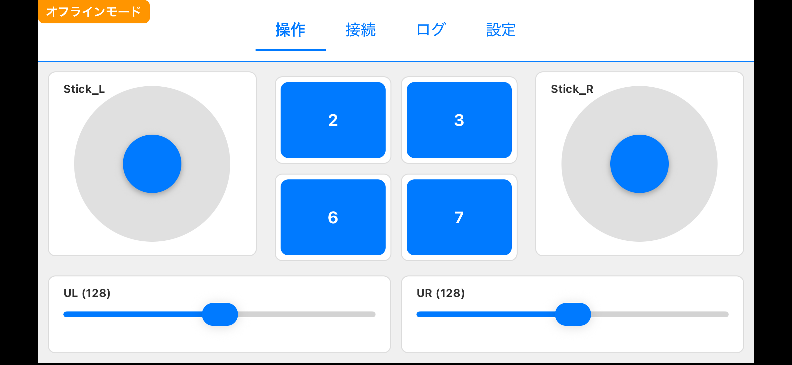
    <figcaption style="font-size:0.95rem;margin-top:8px;">操作画面の例1</figcaption>
  </figure>

  <figure style="display:inline-block;text-align:center;margin:6px;vertical-align:top;width:240px;">
    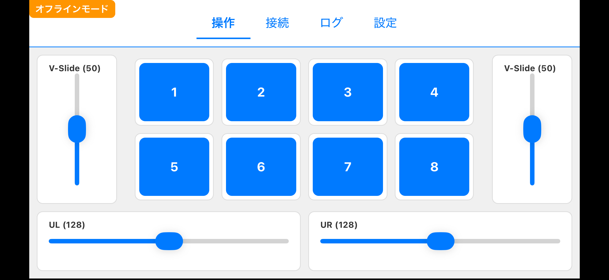
    <figcaption style="font-size:0.95rem;margin-top:8px;">操作画面の例2</figcaption>
  </figure>

  <figure style="display:inline-block;text-align:center;margin:6px;vertical-align:top;width:240px;">
    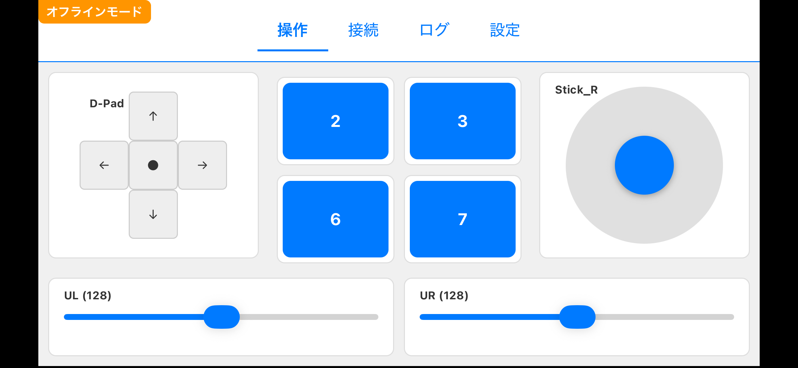
    <figcaption style="font-size:0.95rem;margin-top:8px;">操作画面の例3</figcaption>
  </figure>

  <figure style="display:inline-block;text-align:center;margin:6px;vertical-align:top;width:240px;">
    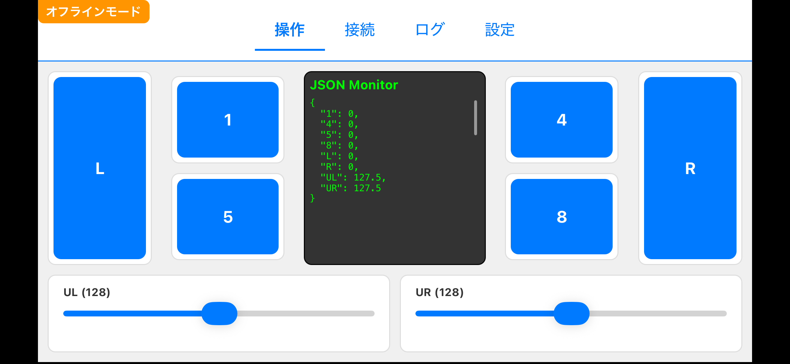
    <figcaption style="font-size:0.95rem;margin-top:8px;">操作画面の例4</figcaption>
  </figure>

  <figure style="display:inline-block;text-align:center;margin:6px;vertical-align:top;width:240px;">
    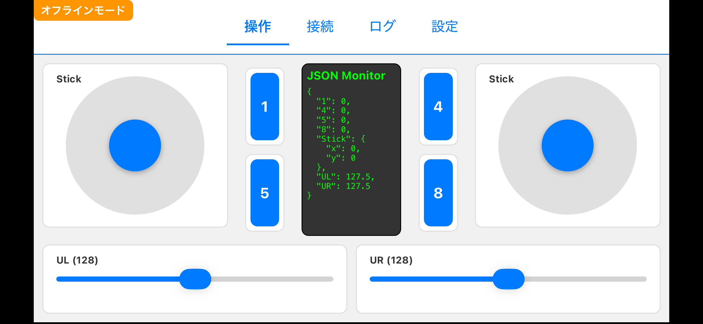
    <figcaption style="font-size:0.95rem;margin-top:8px;">操作画面の例5</figcaption>
  </figure>

### **接続画面**
接続するBLEマイコンを選択する画面です。  
プログラム内でデバイス名の先頭に「JCON-」をつけることでこの画面に出てきます。近くに複数の対応デバイスがある場合は、リストから接続したいデバイスを選択して接続します。  
以下の画像では、近くにある「JCON-ESPESP」というデバイスが表示されています。

  <figure style="display:inline-block;text-align:center;margin:6px;vertical-align:top;width:240px;">
    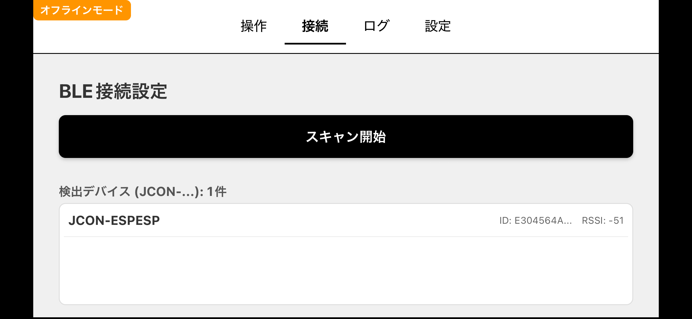
    <figcaption style="font-size:0.95rem;margin-top:8px;">接続画面</figcaption>
  </figure>

### **ログ**
ログが表示されます。

  <figure style="display:inline-block;text-align:center;margin:6px;vertical-align:top;width:240px;">
    
    <figcaption style="font-size:0.95rem;margin-top:8px;">ログ画面の例</figcaption>
  </figure>

### 設定
各種設定を行う画面です。  
以下のような項目を設定できます。  
- JSONモニタの表示/非表示
- 色テーマ
- BLE送信周期
- 各スロットに割り当てる機能(ボタン、ジョイスティック、スライダー)  
  
各スロットのラベル名を編集することで、JSONのキー名に反映されます．また、ジョイスティックとスライダーはその最大値を設定することができます．

  <figure style="display:inline-block;text-align:center;margin:6px;vertical-align:top;width:240px;">
    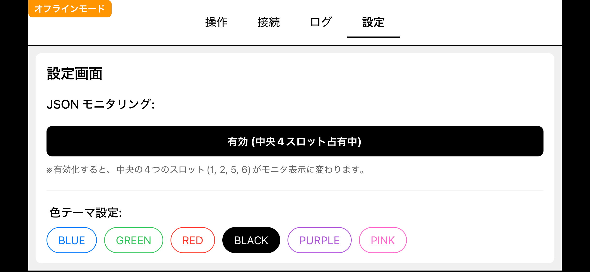
    <figcaption style="font-size:0.95rem;margin-top:8px;">JSONモニタの表示/非表示</figcaption>
  </figure>

  <figure style="display:inline-block;text-align:center;margin:6px;vertical-align:top;width:240px;">
    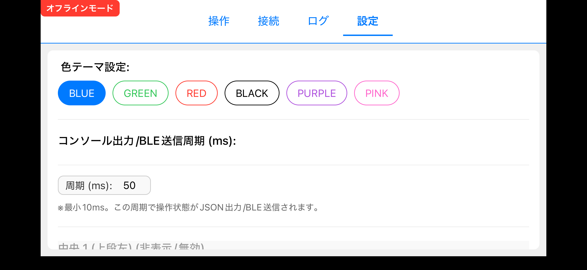
    <figcaption style="font-size:0.95rem;margin-top:8px;">色テーマ/BLE送信周期</figcaption>
  </figure>

  <figure style="display:inline-block;text-align:center;margin:6px;vertical-align:top;width:240px;">
    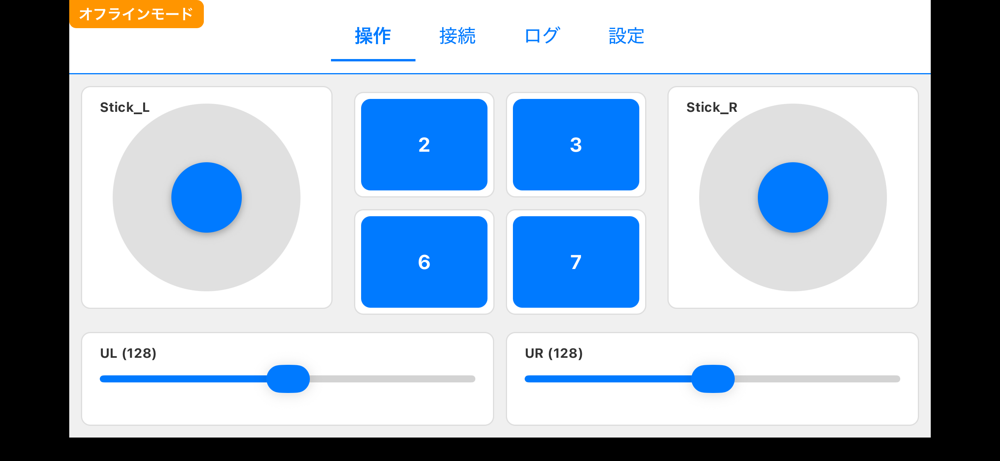
    <figcaption style="font-size:0.95rem;margin-top:8px;">操作画面(青)</figcaption>
  </figure>

  <figure style="display:inline-block;text-align:center;margin:6px;vertical-align:top;width:240px;">
    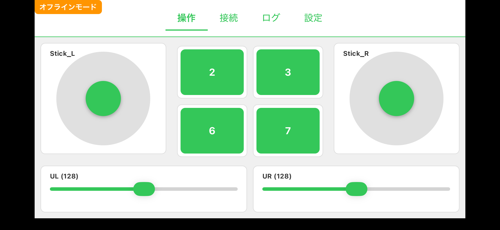
    <figcaption style="font-size:0.95rem;margin-top:8px;">操作画面(緑)</figcaption>
  </figure>

  <figure style="display:inline-block;text-align:center;margin:6px;vertical-align:top;width:240px;">
    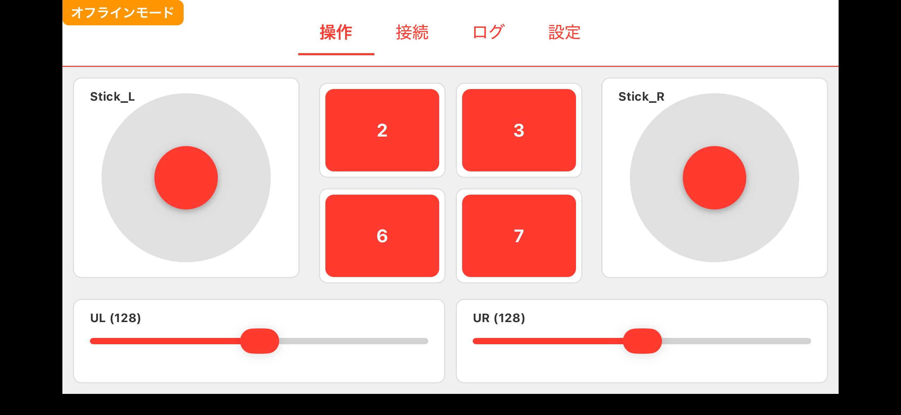
    <figcaption style="font-size:0.95rem;margin-top:8px;">操作画面(赤)</figcaption>
  </figure>

<figure style="display:inline-block;text-align:center;margin:6px;vertical-align:top;width:240px;">
    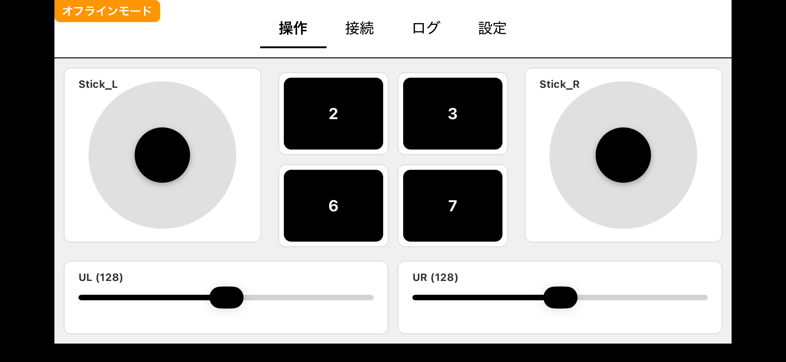
    <figcaption style="font-size:0.95rem;margin-top:8px;">操作画面(黒)</figcaption>
  </figure>

<figure style="display:inline-block;text-align:center;margin:6px;vertical-align:top;width:240px;">
    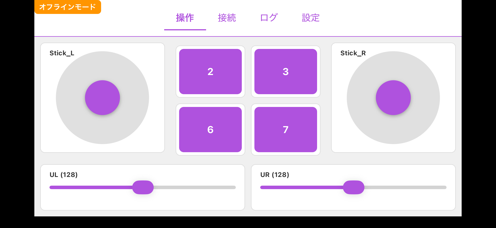
    <figcaption style="font-size:0.95rem;margin-top:8px;">操作画面(紫)</figcaption>
  </figure>

<figure style="display:inline-block;text-align:center;margin:6px;vertical-align:top;width:240px;">
    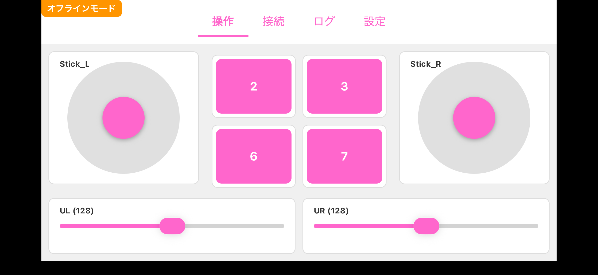
    <figcaption style="font-size:0.95rem;margin-top:8px;">操作画面(ピンク)</figcaption>
  </figure>

<figure style="display:inline-block;text-align:center;margin:6px;vertical-align:top;width:240px;">
    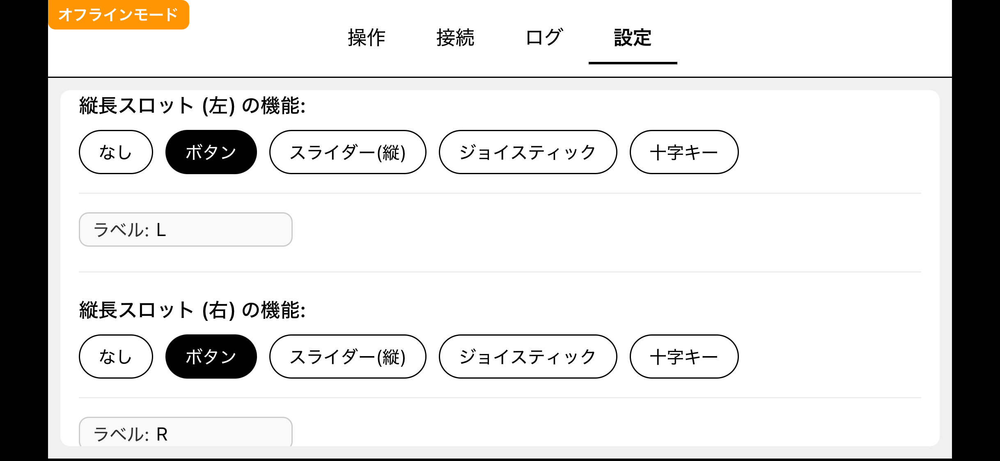
    <figcaption style="font-size:0.95rem;margin-top:8px;">スロット機能選択</figcaption>
  </figure>

## 使い方
1.設定画面で送信周期や各スロットの機能を設定  
2.接続画面で接続するデバイスを選択  
3.コントローラーを操作してデバイスに送信

## リンクとドキュメント

| 項目                     | URL                                               | 備考                            |
| :----------------------- | :------------------------------------------------ | :------------------------------ |
| **App Store (iOS)**      | https://apps.apple.com/jp/app/jcon/id6755073955                       | App Storeでアプリをダウンロード |
| **プライバシーポリシー** | https://jani-onct.github.io/JCON-JSON_Controller/ | 本アプリのプライバシーポリシー  |
